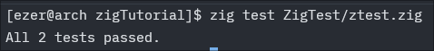

# 📚 Educational project (Maybe) «[Zig Documentation]»
(Yes, I'm shocked myself that I'm doing this, but sometimes there's just nothing else to do, well, you know how it is.)

In short, let's figure out what we're going to do here today: why, for what purpose, and how.
First, we'll install everything we need, then I'll analyze the code a bit and we'll go step by step (oh, oh, oh, I'll tell you upfront that I brazenly lifted parts of the code and descriptions from the original documentation and others, and of course, I added a few of my own.) Here, I'd just like to explain everything as it is, so the average user can understand it, etc., well, you get the idea. And welcome to the best Zig guide in the universe! Sit back, pour yourself a cookie, and drink some juice.! (|_|)

```
At the end, interesting information awaits you, or not really, depending on whether you find me interesting as a person or not. And my content. I'll also say upfront that as I gain more experience with ZIG, I'll be improving and refining the documentation to a proper standard, but for now, here's what I have...
```

---

## Installing Packages. 👋≧◉ᴥ◉≦
* [Zig Download](https://ziglang.org/download/) – zig download.!

In short, first let's install everything, and to do this we need to take the following steps:
Visit the website above (this is the official Zig website).!

1 - Next, let's find out what architecture you need for this in Linux, run this command:
```bash
uname -m
```
After that, download a file with a similar architecture to your processor.

2 - Next, let's unpack your archive:
```bash
tar -xvf zig-x86_64-linux-0.16.0-dev.731+958faa703.tar.xz
```

3 - Add the location of your Zig executable to your path, e.g:
```bash
echo 'export PATH="$HOME/zig-x86_64-linux-0.16.0-dev:$PATH"' >> ~/.bashrc
```
---

### Verifying your install (̶◉͛‿◉̶)
If you're lucky and it works, you can check the installed zig in this way:
```
zig version
0.16.0
```
---

### In general, it will be even easier to do the following steps below to ensure everything is installed correctly. ( ͡❛‿‿ ͡❛)
Just install it through your distribution, that's right, right?
Sorry user Windows, i love Linux.:) (͡° ͜ʖ ͡°)

Linux:

```bash
Arch/Artix: sudo pacman -S zig (I RECOMEND) -> {zed(minimal code editor) hyperland(Linux)}

NixOS: environment.systemPackages = with pkgs; [
    zig
  ];
```

Photo:


---

## 🔖 Content
- This is the base.!
- Comments
- Values
- Pointers
- Function
- Test

---

## This is the base.! ( ͡~‿‿ ͡°)
First, what is this Zig thing and what is it for? Well, the first thing I can say is that it's kind of similar to C or C++ (if you're familiar with them). Let's take it from there.
- Zig is a general-purpose programming language and a set of tools for supporting reliable, optimal, and reusable software (at least that's how its developers position it).
- Zig is mainly needed for highly sensitive programs like game engines, various types of software, or even systems. But you can write almost any software just like in C if you know what to do and how.
- You can also use Zig with your C and C++ code to improve it.
And damn, what a cool logo Zig has.

Let's take a look at our first program:
```zig
const std = @import("std"); // std lib
const print = std.debug.print; // print text

pub fn main() !void { // main
    print("Hello, {s}\n", .{"Zig.!"}); // cteate consol text Hello, Zig.!
}

```
You might ask what's going on here, and I won't drag it out like many others and will explain it.

- First, we call a library such as std (it contains that very same print)
- Next comes my joke, and if you noticed, the library isn't just called, we give it a name. So, next, I call the library again: const print = std.debug.print; but now I name it print and print output not through a big tree, but through a single word. In short, I name the library and connect the print root to it for output. Now, where I write all this code with std.debug.print, I can only use print. (Damn cool!)
- Next, we have the public main function, and then comes !void , which, as I understand it, is used to return some kind of magical error. And then we see our print.
- print works like this {"here, for example, is your name{s}\n (\n switches the console to the next level, and the brackets with s are just our secondary output)", .{the secondary call is located here}} I hope I didn't confuse you.

Finally, you can look at the Println/printl.zig example and finally build it with the zig build command. (Before that, just remember to change line 11 in build.zig to what you want to build.) And there you have it: Hello Zig!

- An example is here: Println/printl.zig

Photo result:


---

## Comments ✍(◔◡◔)

Comments in Zig are implemented a little differently than in C or C++, so be prepared.

- // Hello Zig.! (base Comments)
- /// End of file.! (Doc Comments)
- //! Top level.! (Top-Level Doc Comments)

You can find more details in the file Comment/column.zig

---

## Values (>‿◠)✌

Primitive Types.!

| Type: 	         | C Equivalent: 	   | Description:                                                                   |
|------------------|-------------------|--------------------                                                            |
| i8 	             | int8_t 	         |   signed 8-bit integer
| u8 	             | uint8_t 	         | unsigned 8-bit integer
| i16 	           | int16_t 	         | signed 16-bit integer
| u16 	           | uint16_t 	       |   unsigned 16-bit integer
| i32 	           | int32_t 	         | signed 32-bit integer
| u32 	           | uint32_t 	       |   unsigned 32-bit integer
| i64 	           | int64_t 	         | signed 64-bit integer
| u64 	           | uint64_t 	       |   unsigned 64-bit integer
| i128 	           | __int128 	       |   signed 128-bit integer
| u128 	           | unsigned __int128 |	unsigned 128-bit integer
| isize 	         | intptr_t 	       |   signed pointer sized integer
| usize 	         | uintptr_t, size_t |	unsigned pointer sized integer. Also see #5185
| c_char 	         | char 	           |   for ABI compatibility with C
| c_short 	       | short 	           | for ABI compatibility with C
| c_ushort 	       | unsigned short 	 |   for ABI compatibility with C
| c_int 	         | int 	             | for ABI compatibility with C
| c_uint 	         | unsigned int 	   |   for ABI compatibility with C
| c_long 	         | long 	           |   for ABI compatibility with C
| c_ulong 	       | unsigned long 	   | for ABI compatibility with C
| c_longlong 	     | long long 	       | for ABI compatibility with C
| c_ulonglong 	   | unsigned long     |  long 	for ABI compatibility with C
| c_longdouble 	   | long double 	     | for ABI compatibility with C                                                    |
| f16 	           | _Float16 	       |   16-bit floating point (10-bit mantissa) IEEE-754-2008 binary16                |
| f32 	           | float 	           | 32-bit floating point (23-bit mantissa) IEEE-754-2008 binary32                  |
| f64 	           | double 	         |   64-bit floating point (52-bit mantissa) IEEE-754-2008 binary64                |
| f80 	           | long double 	     | 80-bit floating point (64-bit mantissa) IEEE-754-2008 80-bit extended precision |
| f128 	           | _Float128 	       | 128-bit floating point (112-bit mantissa) IEEE-754-2008 binary128               |
| bool 	           | bool 	           |   true or false                                                                 |
| anyopaque 	     | void 	           |   Used for type-erased pointers.                                                |
| void 	           | (none) 	         |   Always the value void{}                                                       |
| noreturn 	       | (none) 	         |   the type of break, continue, return, unreachable, and while (true) {}         |
| type 	           | (none) 	         |   the type of types                                                             |
| anyerror 	       | (none) 	         |   an error code                                                                 |
| comptime_int 	   | (none) 	         |   Only allowed for comptime-known values. The type of integer literals.         |
| comptime_float 	 | (none) 	         |   Only allowed for comptime-known values. The type of float literals.           |

In addition to the integer types above, arbitrary bit-width integers can be referenced by using an identifier of i or u followed by digits. For example, the identifier i7 refers to a signed 7-bit integer. The maximum allowed bit-width of an integer type is 65535.

Next, I created a file in which you can see the simplified operation of variables yourself. (Values/var.zig)
I'll also briefly describe how it works and then we'll fly on.

### Values
Every variable can be declared in two ways: const and var (What's the big deal, ask, and I'll tell you right now). Basically, the const type can take a value but can't change it, while var can take a value and then change it.

The entire variable declaration is written like this: const a: i5 = 0; (var A: i5 = 0;) where const(var) is the type, a is your variable name, and i5 is the variable type. i = integer, u = unsigned, and the number next to it is the number of bytes for your variable. (I found out that 5 bytes is the minimum variable you can create, and the total storage can't be less than 65535.)

You can see the example and other things in my file. (Values/var.zig)
Here is a basic example for your reference:
```zig
const a: i5 = 0; // int i5-6-7-8-9-10.... (128) number of bytes
// const immutable variable
var A: i5 = 0; // int i5-6-7-8-9-10.... (128) number of bytes
// const mutable variable
```

### Undefined

- You can get acquainted with this type here: Undefined/undef.zig

- An example is here: Values/var.zig

---

## Destructuring ᕙ(`▿´)ᕗ
A destructuring assignment can separate elements of indexable aggregate types (Tuples, Arrays, Vectors).
What is it, what does it look like, and how to live in general, I'll show and tell you now:

### Tuples
- Anonymous structs can be created without specifying field names, and are referred to as "tuples". An empty tuple looks like .{} and can be seen in one of the Hello World examples.
- The fields are implicitly named using numbers starting from 0. Because their names are integers, they cannot be accessed with . syntax without also wrapping them in @"". Names inside @"" are always recognised as identifiers.
- Like arrays, tuples have a .len field, can be indexed (provided the index is comptime-known) and work with the ++ and ** operators. They can also be iterated over with inline for.

Can be initialized:
```zig
// Tuples
const tuple = .{ 7, 3, 1 };
```

### Arrays
It looks something like this:
- The size is fixed and is part of the type.
- The compiler checks access boundaries only in -Doptimize=Debug mode; in release mode, these checks can be disabled (can be enabled with -Dcheck-bounds).

Can be initialized:
```zig
// Array
var array: [3]u8 = .{ 'a', 'b', 'c' };
```

### Vectors
A vector is a group of booleans, Integers, Floats, or Pointers which are operated on in parallel, using SIMD instructions if possible. Vector types are created with the builtin function @Vector.

Vectors generally support the same builtin operators as their underlying base types. The only exception to this is the keywords `and` and `or` on vectors of bools, since these operators affect control flow, which is not allowed for vectors. All other operations are performed element-wise, and return a vector of the same length as the input vectors. This includes:

-   Arithmetic (+, -, /, *, @divFloor, @sqrt, @ceil, @log, etc.)
-   Bitwise operators (>>, <<, &, |, ~, etc.)
-   Comparison operators (<, >, ==, etc.)
-   Boolean not (!)

It is prohibited to use a math operator on a mixture of scalars (individual numbers) and vectors. Zig provides the @splat builtin to easily convert from scalars to vectors, and it supports @reduce and array indexing syntax to convert from vectors to scalars. Vectors also support assignment to and from fixed-length arrays with comptime-known length.

For rearranging elements within and between vectors, Zig provides the @shuffle and @select functions.

Operations on vectors shorter than the target machine's native SIMD size will typically compile to single SIMD instructions, while vectors longer than the target machine's native SIMD size will compile to multiple SIMD instructions. If a given operation doesn't have SIMD support on the target architecture, the compiler will default to operating on each vector element one at a time. Zig supports any comptime-known vector length up to 2^32-1, although small powers of two (2-64) are most typical. Note that excessively long vector lengths (e.g. 2^20) may result in compiler crashes on current versions of Zig.

Can be initialized:
```zig
// Vectors
const vector: @Vector(3, u32) = .{ 2, 3, 8 };
```

- An example is here: Destructuring/destruct.zig

---

## Pointers (͠≖ ͜ʖ͠≖)👌
So I hope you haven't dropped out yet, but if not, then great! Now we'll talk about pointers. I'm not a genius at this, so I'll show and tell you how I know and see it myself.

Normal pointers in Zig cannot have 0 or null as a value. They follow the syntax *A, where A is the child type.

Referencing is done with &variable, and dereferencing is done with variable.*.
```zig
const std = @import("std");
const print = std.debug.print;

var z: i5 = 2; // variable 2

fn points(a: *i5) void { // point
    a.* += 1; // point a + 1
}

pub fn main() !void {
    points(&z); // peference, z = 3 (2 + 1 = 3)
    print("Values: {}\n", .{z}); // print variable
}
```
After the build we will get: Values: 3.
Photo result:


Brief and clear. We create a pointer to the function value and then send this pointer to a.* += 1; to add +1, and then we call our function and create a reference to our pointer to retrieve the data from it. Well, that's about it (don't scold me if I'm wrong somewhere...)

Trying to set a *T to the value 0 is detectable illegal behaviour.
```zig
test "naughty pointer" {
    var x: u16 = 5;
    x -= 5;
    var y: *u8 = @ptrFromInt(x);
    y = y;
}
```
ERROR:
```bash
Test [23/126] test.naughty pointer... thread 21598 panic: cast causes pointer to be null
./test-c1.zig:252:18: 0x260a91 in test.naughty pointer (test)
    var y: *u8 = @ptrFromInt(x);
                 ^
```

Zig also has const pointers, which cannot be used to modify the referenced data. Referencing a const variable will yield a const pointer.
```zig
test "const pointers" {
    const x: u8 = 1;
    var y = &x;
    y.* += 1;
}
```
ERROR:
```bash
error: cannot assign to constant
    y.* += 1;
        ^
```

- Also, again, an example of pointers is here: Pointers/point.zig

---

## Function (─‿‿─)
A function is a piece of code that does something and we can call it (in short, you know Lego, and each model has its own parts, so you could say we're creating these parts for our overall model, that is, our code).

I think it's simple here: we create a function like this: fn points(a: i5) void {} Here, I have the value of the variable a: i5 . You can do without it, or you can add another one, like this: fn fon(a: i5, b: i5) void {} . Then we can use these values in our function code.

Then, after assigning or not assigning values (without them), we can write our code in main , and it will look something like this:
```zig
var z: i5 = 2; // variable 2
var f: i5 = 2; // variable 2

fn fon(a: i5, b: i5) i12 {
    return a + b;
}

pub fn main() !void { // public function main
    const g = fon(z, f);
    print("Values: {}\n", .{g}); // print variable
}
```

### Recursion
When recursion happens, the compiler is no longer able to work out the maximum stack size, which may result in unsafe behaviour - a stack overflow. Details on how to achieve safe recursion will be covered in the future.

Values can be ignored using _ instead of a variable or const declaration. This does not work at the global scope (i.e. it only works inside functions and blocks) and is useful for ignoring the values returned from functions if you do not need them.

```
_ = 10;
```

Code:
```zig
const expect = @import("std").testing.expect;

fn fibonacci(n: u16) u16 {
    if (n == 0 or n == 1) return n;
    return fibonacci(n - 1) + fibonacci(n - 2);
}

test "function recursion" {
    const x = fibonacci(10);
    try expect(x == 55);
}
```

- An example is here: Function/fun.zig

---

## Test ≧◠ᴥ◠≦✊
I'll briefly explain how I understood this and how it works. Basically, you create a test block from the standard library std and write an assertion in it that will be printed to the console. Then, you create a try block std.testing.expect , which can be shortened by defining it in the library like this: const testing = std.testing.expect; The try block serves as an error output indicating that the test failed, or something similar. expect is a function that checks the truth of its argument. Testing is precisely what selects the function to test.

Next, we create a test function, addOne , in which we write our test condition. In the main function, fn addOne , we write the test execution itself, like this: number + 1; and after the condition is met, the program terminates with return . (I need to study this a bit more, so I can't say much.)

Code written within one or more test declarations can be used to ensure behavior meets expectations:

- Code:
```zig
const std = @import("std");
// const testing = std.testing.expect;

test "expect addOne adds one to 41" {

    // The Standard Library contains useful functions to help create tests.
    // `expect` is a function that verifies its argument is true.
    // It will return an error if its argument is false to indicate a failure.
    // `try` is used to return an error to the test runner to notify it that the test failed.
    try std.testing.expect(addOne(41) == 42);
}

test addOne {
    // A test name can also be written using an identifier.
    // This is a doctest, and serves as documentation for `addOne`.
    try std.testing.expect(addOne(41) == 42);
}

/// The function `addOne` adds one to the number given as its argument.
fn addOne(number: i32) i32 {
    return number + 1;
}
```

- Shell:
```bash
$ zig test ztest.zig
1/2 testing_introduction.test.expect addOne adds one to 41...OK
2/2 testing_introduction.decltest.addOne...OK
All 2 tests passed.
```



The testing_introduction.zig code sample tests the function addOne to ensure that it returns 42 given the input 41. From this test's perspective, the addOne function is said to be code under test.

zig test is a tool that creates and runs a test build. By default, it builds and runs an executable program using the default test runner provided by the Zig Standard Library as its main entry point. During the build, test declarations found while resolving the given Zig source file are included for the default test runner to run and report on.

- This documentation discusses the features of the default test runner as provided by the Zig Standard Library. Its source code is located in lib/compiler/test_runner.zig.

 The shell output shown above displays two lines after the zig test command. These lines are printed to standard error by the default test runner:

1/2 testing_introduction.test.expect addOne adds one to 41...
    Lines like this indicate which test, out of the total number of tests, is being run. In this case, 1/2 indicates that the first test, out of a total of two tests, is being run. Note that, when the test runner program's standard error is output to the terminal, these lines are cleared when a test succeeds.
2/2 testing_introduction.decltest.addOne...
    When the test name is an identifier, the default test runner uses the text decltest instead of test.
All 2 tests passed.
    This line indicates the total number of tests that have passed.

- An example is here: ZigTest/ztest.zig

### Test Declarations
Test declarations contain the keyword test, followed by an optional name written as a string literal or an identifier, followed by a block containing any valid Zig code that is allowed in a function.

Non-named test blocks always run during test builds and are exempt from Skip Tests.

Test declarations are similar to Functions: they have a return type and a block of code. The implicit return type of test is the Error Union Type anyerror!void, and it cannot be changed. When a Zig source file is not built using the zig test tool, the test declarations are omitted from the build.

Test declarations can be written in the same file, where code under test is written, or in a separate Zig source file. Since test declarations are top-level declarations, they are order-independent and can be written before or after the code under test.

### Doctests
Test declarations named using an identifier are doctests. The identifier must refer to another declaration in scope. A doctest, like a doc comment, serves as documentation for the associated declaration, and will appear in the generated documentation for the declaration.

An effective doctest should be self-contained and focused on the declaration being tested, answering questions a new user might have about its interface or intended usage, while avoiding unnecessary or confusing details. A doctest is not a substitute for a doc comment, but rather a supplement and companion providing a testable, code-driven example, verified by zig test.

### Test Failure
 The default test runner checks for an error returned from a test. When a test returns an error, the test is considered a failure and its error return trace is output to standard error. The total number of failures will be reported after all tests have run.

Code:
 ```zig
 const std = @import("std");

 test "expect this to fail" {
     try std.testing.expect(false);
 }

 test "expect this to succeed" {
     try std.testing.expect(true);
 }
 ```

 Bash:
 ```bash
 $ zig test ZigTest/testing_failure.zig
 1/2 testing_failure.test.expect this to fail...FAIL (TestUnexpectedResult)
 /home/andy/dev/zig/lib/std/testing.zig:607:14: 0x102f019 in expect (std.zig)
     if (!ok) return error.TestUnexpectedResult;
              ^
 /home/andy/dev/zig/doc/langref/testing_failure.zig:4:5: 0x102f078 in test.expect this to fail (testing_failure.zig)
     try std.testing.expect(false);
     ^
 2/2 testing_failure.test.expect this to succeed...OK
 1 passed; 0 skipped; 1 failed.
 error: the following test command failed with exit code 1:
 /home/andy/dev/zig/.zig-cache/o/bac0cff07a7d3f5b652a5a9cf02e6de1/test --seed=0x7a2fdb1
 ```

 - An example is here: ZigTest/testing_failure.zig

### Skip Tests
One way to skip tests is to filter them out by using the zig test command line parameter --test-filter [text]. This makes the test build only include tests whose name contains the supplied filter text. Note that non-named tests are run even when using the --test-filter [text] command line parameter.

To programmatically skip a test, make a test return the error error.SkipZigTest and the default test runner will consider the test as being skipped. The total number of skipped tests will be reported after all tests have run.

Code:
```zig
test "this will be skipped" {
    return error.SkipZigTest;
}
```

Bash:
```bash
$ zig test ZigTest/testing_skip.zig
1/1 testing_skip.test.this will be skipped...SKIP
0 passed; 1 skipped; 0 failed.
```

- An example is here: ZigTest/testing_skip.zig

### Test Report Memory Leaks
When code allocates Memory using the Zig Standard Library's testing allocator, std.testing.allocator, the default test runner will report any leaks that are found from using the testing allocator.

Code:
```zig
const std = @import("std");

test "detect leak" {
    var list = std.array_list.Managed(u21).init(std.testing.allocator);
    // missing `defer list.deinit();`
    try list.append('☔');

    try std.testing.expect(list.items.len == 1);
}
```

Bash:
```bash
$ zig test ZigTest/testing_detect_leak.zig
1/1 testing_detect_leak.test.detect leak...OK
[gpa] (err): memory address 0x7f74a8aa0000 leaked:
/home/andy/dev/zig/lib/std/array_list.zig:468:67: 0x10aa8fe in ensureTotalCapacityPrecise (std.zig)
                const new_memory = try self.allocator.alignedAlloc(T, alignment, new_capacity);
                                                                  ^
/home/andy/dev/zig/lib/std/array_list.zig:444:51: 0x107c9e4 in ensureTotalCapacity (std.zig)
            return self.ensureTotalCapacityPrecise(better_capacity);
                                                  ^
/home/andy/dev/zig/lib/std/array_list.zig:494:41: 0x105590d in addOne (std.zig)
            try self.ensureTotalCapacity(newlen);
                                        ^
/home/andy/dev/zig/lib/std/array_list.zig:252:49: 0x1038771 in append (std.zig)
            const new_item_ptr = try self.addOne();
                                                ^
/home/andy/dev/zig/doc/langref/testing_detect_leak.zig:6:20: 0x10350a9 in test.detect leak (testing_detect_leak.zig)
    try list.append('☔');
                   ^
/home/andy/dev/zig/lib/compiler/test_runner.zig:218:25: 0x1174760 in mainTerminal (test_runner.zig)
        if (test_fn.func()) |_| {
                        ^
/home/andy/dev/zig/lib/compiler/test_runner.zig:66:28: 0x1170d81 in main (test_runner.zig)
        return mainTerminal();
                           ^
/home/andy/dev/zig/lib/std/start.zig:618:22: 0x116ab1d in posixCallMainAndExit (std.zig)
            root.main();
                     ^
/home/andy/dev/zig/lib/std/start.zig:232:5: 0x116a3b1 in _start (std.zig)
    asm volatile (switch (native_arch) {
    ^

All 1 tests passed.
1 errors were logged.
1 tests leaked memory.
error: the following test command failed with exit code 1:
/home/andy/dev/zig/.zig-cache/o/4df377b3969e36bf7e0b2704790b75be/test --seed=0xabc34e97
```

- An example is here: ZigTest/testing_detect_leak.zig

### Detecting Test Build
Use the compile variable @import("builtin").is_test to detect a test build.

Code:
```Zig
const std = @import("std");
const builtin = @import("builtin");
const expect = std.testing.expect;

test "builtin.is_test" {
    try expect(isATest());
}

fn isATest() bool {
    return builtin.is_test;
}
```

Bash:
```bash
$ zig test ZigTest/test_del.zig
```

- An example is here: ZigTest/test_del.zig

### Test Output and Logging
The default test runner and the Zig Standard Library's testing namespace output messages to standard error.

### The Testing Namespace
The Zig Standard Library's testing namespace contains useful functions to help you create tests. In addition to the expect function, this document uses a couple of more functions as exemplified here

Code:
```zig
const std = @import("std");

test "expectEqual demo" {
    const expected: i32 = 42;
    const actual = 42;

    // The first argument to `expectEqual` is the known, expected, result.
    // The second argument is the result of some expression.
    // The actual's type is casted to the type of expected.
    try std.testing.expectEqual(expected, actual);
}

test "expectError demo" {
    const expected_error = error.DemoError;
    const actual_error_union: anyerror!void = error.DemoError;

    // `expectError` will fail when the actual error is different than
    // the expected error.
    try std.testing.expectError(expected_error, actual_error_union);
}
```

Bash:
```bash
$ zig test ZigTest/testing_namespace.zig
1/2 testing_namespace.test.expectEqual demo...OK
2/2 testing_namespace.test.expectError demo...OK
All 2 tests passed.
```

- An example is here: ZigTest/testing_namespace.zig

The Zig Standard Library also contains functions to compare Slices, strings, and more. See the rest of the std.testing namespace in the Zig Standard Library for more available functions.

### Test Tool Documentation
zig test has a few command line parameters which affect the compilation. See zig test --help for a full list.

---

## Variables ≧◉◡◉≦
Variables are like the ones we used before, like const var and others. (But these two are the most commonly used.)

Also, if you want to cross your Zig code with C code, there are some tricks there. I'm no genius, so forgive me for not being able to provide more precise information right now. (But as I learn more, I'll continue to add and improve the documentation. Thanks.)

```Zig
const i: i7; // Variables const
var p: i7; // Variables var
```

The extern keyword or @extern builtin function can be used to link against a variable that is exported from another object. The export keyword or @export builtin function can be used to make a variable available to other objects at link time. In both cases, the type of the variable must be C ABI compatible.

### Identifiers
Variable identifiers are never allowed to shadow identifiers from an outer scope.

Identifiers must start with an alphabetic character or underscore and may be followed by any number of alphanumeric characters or underscores. They must not overlap with any keywords. See Keyword Reference:

- addrspace
- align
- allowzero
- and
- anyframe
- anytype
- asm
- break
- callconv
- catch
- comptime
- const
- continue
- defer
- else
- enum
- errdefer
- error
- export
- extern
- fn
- for
- if
- inline
- linksection
- noalias
- noinline
- nosuspend
- opaque
Подробнее об остальном можно узнать здесь > https://ziglang.org/documentation/0.15.2/#Source-Encoding

If a name that does not fit these requirements is needed, such as for linking with external libraries, the @"" syntax may be used.

Code:
```zig
const @"identifier with spaces in it" = 0xff;
const @"1SmallStep4Man" = 112358;

const c = @import("std").c;
pub extern "c" fn @"error"() void;
pub extern "c" fn @"fstat$INODE64"(fd: c.fd_t, buf: *c.Stat) c_int;

const Color = enum {
    red,
    @"really red",
};
const color: Color = .@"really red";
```

### Container Level Variables
Container level variables have static lifetime and are order-independent and lazily analyzed. The initialization value of container level variables is implicitly comptime. If a container level variable is const then its value is comptime-known, otherwise it is runtime-known.

Code:
```zig
var y: i32 = add(10, x);
const x: i32 = add(12, 34);

test "container level variables" {
    try expect(x == 46);
    try expect(y == 56);
}

fn add(a: i32, b: i32) i32 {
    return a + b;
}

const std = @import("std");
const expect = std.testing.expect;
```

Bash:
```bash
$ zig test Variables/test_container_level_variables.zig
1/1 test_container_level_variables.test.container level variables...OK
All 1 tests passed.
```

- An example is here: Variables/test_container_level_variables.zig

Container level variables may be declared inside a struct, union, enum, or opaque:

```zig
const std = @import("std");
const expect = std.testing.expect;

test "namespaced container level variable" {
    try expect(foo() == 1235);
    try expect(foo() == 1236);
}

const S = struct {
    var x: i32 = 1234;
};

fn foo() i32 {
    S.x += 1;
    return S.x;
}
```

Bash:
```bash
$ zig test Variables/test_namespaced_container_level_variable.zig
1/1 test_namespaced_container_level_variable.test.namespaced container level variable...OK
All 1 tests passed.
```

- An example is here: Variables/test_namespaced_container_level_variable.zig

### Static Local Variables
It is also possible to have local variables with static lifetime by using containers inside functions:

Code:
```zig
const std = @import("std");
const expect = std.testing.expect;

test "static local variable" {
    try expect(foo() == 1235);
    try expect(foo() == 1236);
}

fn foo() i32 {
    const S = struct {
        var x: i32 = 1234;
    };
    S.x += 1;
    return S.x;
}
```

Bash:
```bash
$ zig Variables/test test_static_local_variable.zig
1/1 test_static_local_variable.test.static local variable...OK
All 1 tests passed.
```

- An example is here: Variables/test test_static_local_variable.zig

### Note.!
- Global and static variables aren't all that different. They're simply different memory areas allocated to a variable based on its address.
- It is also impossible to define a global variable without storing it in static memory.
- Once a structure is declared, it can contain fields and declarations:
```zig
const st = struct {
    value: i7, // value is a field
    var svalue: i7 = 0, // svalue is a declaration
    // Each element of a struct has its own value and so on for each
}
```

- There's very little information, so I can't really describe anything else. I'm still learning about it.

### Thread Local Variables
A variable can be specified as a thread-local variable using the threadlocal keyword, which causes each thread to operate on a separate instance of the variable like so:
Code:
```zig
const std = @import("std");
const assert = std.debug.assert;

threadlocal var x: i32 = 1234;

test "thread local storage" {
    const thread1 = try std.Thread.spawn(.{}, testTls, .{});
    const thread2 = try std.Thread.spawn(.{}, testTls, .{});
    testTls();
    thread1.join();
    thread2.join();
}

fn testTls() void {
    assert(x == 1234);
    x += 1;
    assert(x == 1235);
}
```

Bash:
```bash
$ zig test Variables/test_thread_local_variables.zig
1/1 test_thread_local_variables.test.thread local storage...OK
All 1 tests passed.
```

- An example is here: Variables/test_thread_local_variables.zig

- For Single Threaded Builds, all thread local variables are treated as regular Container Level Variables.
- A local variable cannot be of type const.

### Local Variables
Local variables occur inside Functions, comptime blocks, and @cImport blocks.

When a local variable is const, it means that after initialization, the variable's value will not change. If the initialization value of a const variable is comptime-known, then the variable is also comptime-known.

A local variable may be qualified with the comptime keyword. This causes the variable's value to be comptime-known, and all loads and stores of the variable to happen during semantic analysis of the program, rather than at runtime. All variables declared in a comptime expression are implicitly comptime variables.

Code:
```zig
const std = @import("std");
const expect = std.testing.expect;

test "comptime vars" {
    var x: i32 = 1;
    comptime var y: i32 = 1;

    x += 1;
    y += 1;

    try expect(x == 2);
    try expect(y == 2);

    if (y != 2) {
        // This compile error never triggers because y is a comptime variable,
        // and so `y != 2` is a comptime value, and this if is statically evaluated.
        @compileError("wrong y value");
    }
}
```

Bash:
```bash
$ zig test test_comptime_variables.zig
1/1 test_comptime_variables.test.comptime vars...OK
All 1 tests passed.
```

- An example is here: Variables/test test_comptime_variables.zig

---

## While ⊙▂⊙
Loops are what I love, and what we all love, I think. No, seriously, they're fun. (Okay, let's get to the point.)
A loop is something that will execute your code continuously until you have a true condition for its termination.
Loops are often used in 3D graphics, multiple outputs, array calculations, and so on.

So how does this work? It's very simple. You have while() , which is your base class or the one that calls the loop. The first thing we do is write while , then in parentheses () we write the condition of our loop, like I have here:
Code:
```zig
const std = @import("std");
const print = std.debug.print;

pub fn main() !void {
    var a: i7 = 1; // a = 8

    while (a <= 8) { // a = 8 > true
        print("While a:{}\n", .{a});
        a += 1;
        if (a == 8) { // if | else a = 8 > print("End of the cycle.!")
            print("End of the cycle.!", .{});
        }
    }
}
```

Bash:
```bash
zig build
cd zig-out/bin
./app

While a:1
While a:2
While a:3
While a:4
While a:5
While a:6
While a:7
End of the cycle.!While a:8
```

Photo result:


As you can see, I've specified a condition in parentheses, just like in if or else , only this is a loop, not a check. So, we have a, and according to the loop condition, our value is less than or equal to 8. Until this is true, the loop will execute and display our message.

After the loop completes, I added a check if when our a is equal to 8, we'll display the message "End of the cycle!" Pretty cool, right?

Basically, you can do whatever you want with this action—display any data or whatever you like.

- Use break to exit a while loop early:
```zig
const expect = @import("std").testing.expect;

test "while break" {
    var i: usize = 0;
    while (true) {
        if (i == 10)
            break;
        i += 1;
    }
    try expect(i == 10);
}
```
- Use continue to jump back to the beginning of the loop. :
```zig
const expect = @import("std").testing.expect;

test "while continue" {
    var i: usize = 0;
    while (true) {
        i += 1;
        if (i < 10)
            continue;
        break;
    }
    try expect(i == 10);
}
```

- An example is here: While/while.zig

### Labeled while
When a while loop is labeled, it can be referenced from a break or continue from within a nested loop.
Code:
```zig
test "nested break" {
    outer: while (true) {
        while (true) {
            break :outer;
        }
    }
}

test "nested continue" {
    var i: usize = 0;
    outer: while (i < 10) : (i += 1) {
        while (true) {
            continue :outer;
        }
    }
}
```

Bash:
```bash
$ zig While/tswhile.zig
1/2 test_while_nested_break.test.nested break...OK
2/2 test_while_nested_break.test.nested continue...OK
All 2 tests passed.
```

- An example is here: While/tswhile.zig

---

It's still a work in progress, so I'll keep adding information as I learn. (I can't just spout off everything from the documentation and open sources.) Okay, stay tuned for patches for this documentation (I want to make it truly the best and most detailed in the future, based on my knowledge and the base documentation, of course.) See you soon. Will there be a patch soon?

# Coming soon...
## The end.! (GG) (►.◄)
